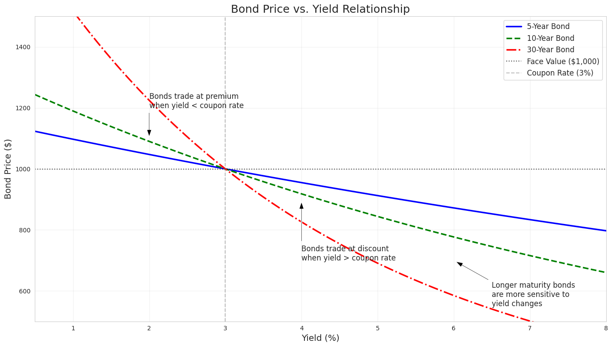

# Bonds: Valuation, Duration, and Interest Rate Risk

---

## Bond Valuation

A bond's value is the present value of all future cash flows:

$$P = \sum_{t=1}^{n} \frac{C}{(1+r)^t} + \frac{F}{(1+r)^n}$$

Where:
- P = Bond price
- C = Coupon payment
- F = Face value (par value)
- r = Required yield (market interest rate)
- n = Number of periods to maturity

---

## Price-Yield Relationship

---

## Macaulay Duration

**Definition**: Weighted average time until a bond's cash flows are received, with weights being the present value of each cash flow relative to the bond's price.

$$D = \frac{\sum_{t=1}^{n} \frac{t \times C_t}{(1+y)^t}}{\sum_{t=1}^{n} \frac{C_t}{(1+y)^t}}$$

Alternatively:

$$D = \frac{\sum_{t=1}^{n} t \times PV(C_t)}{P}$$

---

## Macaulay Duration Example

For a 3-year bond with: Face of $1,000; ytm of 5%; Annual cpns of $50

| Time (t) | Cash Flow | PV of Cash Flow | t × PV of Cash Flow |
|----------|-----------|-----------------|---------------------|
| 1        | $50       | $47.62          | $47.62              |
| 2        | $50       | $45.35          | $90.70              |
| 3        | $1,050    | $907.03         | $2,721.08           |
|          | **Total** | **$1,000.00**   | **$2,859.40**       |

Macaulay Duration = $2,859.40 / $1,000.00 = 2.86 years

---

## Interpreting Macaulay Duration

- Represents weighted average time until cash flows are received
- Weights are proportional to present value of each cash flow
- Weights sum to 1
- Intuition: Average time to receive the bond's value
- Macaulay Duration of 2.86 years means weighted-average time to receive all cash flows is 2.86 years
- Provides a measure of the bond's interest rate risk

---

## Modified Duration

**Why modify Macaulay Duration?**

1. Non-linear relationship between price and yield
2. Different compounding frequencies affect price sensitivity
3. Need scaling factor to convert from time measure to price sensitivity measure

---

## Modified Duration Formula

$$\text{Modified Duration} = \frac{\text{Macaulay Duration}}{(1 + \frac{y}{n})}$$

Where:
- y = yield to maturity (in decimal form)
- n = number of compounding periods per year

---

## Modified Duration's Practical Significance

- Directly approximates percentage change in bond price for a 1% change in yield
- Example: Modified Duration of 5 means 1% increase in interest rates → ~5% decrease in bond price
- Formula for price sensitivity:

$$\frac{\Delta P}{P} \approx -\text{Modified Duration} \times \Delta y$$

---

## When Modified Duration Matters Most

- Interest rates are high
- Compounding periods are more frequent than annual
- More precise risk management is required
- Without modification, Macaulay Duration would overestimate price sensitivity in most scenarios

---

## Mathematical Derivation (Simplified)

1. Start with bond price function and differentiate with respect to yield
2. Calculate percentage change in price relative to yield change
3. Factor out Macaulay Duration
4. Apply adjustment for compounding frequency

$$\frac{1}{P} \times \frac{dP}{dy} = -\frac{D_{mac}}{1+y/m} \times \frac{1}{m} = -\frac{D_{mod}}{m}$$

---

## Key Takeaways

1. Bond value = PV of all future cash flows
2. Price and yield have inverse, non-linear relationship
3. Macaulay Duration = weighted average time to receive cash flows
4. Modified Duration = practical measure of interest rate risk
5. Modified Duration approximates % price change for 1% yield change